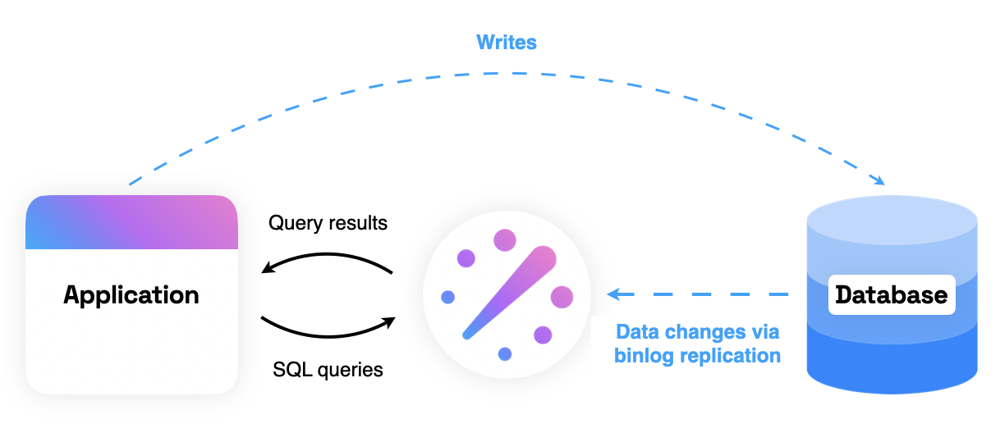

# What is ReadySet?

ReadySet is a lightweight SQL caching engine that sits between your application and database and turns even the most complex SQL reads into lightning-fast lookups. Unlike other caching solutions, ReadySet keeps the cache up-to-date automatically and requires no changes to your application code.

## How does ReadySet work?

Based on years of dataflow research at MIT[^1], ReadySet stores the results of queries in-memory and automatically keeps queries up-to-date as the underlying database changes. When the cache gets too full, ReadySet dynamically chooses which rows to evict. ReadySet can do this automatically because it listens to your database's replication logs.

This means:

- No extra code to keep your cache and database in sync
- No extra code to evict stale records
- No TTLs to set - your cache is as up-to-date as your replication lag

ReadySet is wire-compatible with MySQL and Postgres. For more on how ReadySet works under the hood, see [Concepts](../concepts/overview.md).

[^1]: See the [Noria](https://pdos.csail.mit.edu/papers/noria:osdi18.pdf) paper.

## When is ReadySet a good fit?

ReadySet is a good fit for read-heavy applications that use MySQL or Postgres as the backing database.

ReadySet is particularly well-suited for the following cases:

- **Reducing latency:** You want sub-millisecond query latency, but you don't want to maintain the custom application logic and infrastructure required by traditional caching solutions like Redis or Memcached.  
- **Increasing throughput:** Your database load is too high, and you want to avoid the expense of scaling or provisioning read replicas and load balancing between them.

## How do you get started with ReadySet?

Integrating with ReadySet is straight-forward:

1. Deploy ReadySet and connect it to your MySQL or Postgres database.
2. Change your application's connection string to point at ReadySet.(1)
3. Cache queries using ReadySet's custom SQL commands.

1.  This is the only required change to your application.   

To run through this process on your local machine, see the [Quickstart](quickstart.md) or [Tutorial](tutorial.md).  

To run through this process in a cloud deployment, see [Deploy with ReadySet Cloud](deploy-readyset-cloud.md) or [Deploy with Kubernetes](deploy-readyset-kubernetes.md).

## How do you connect to ReadySet?

Once you have a ReadySet instance up and running, the next step is to connect your application by swapping out your database connection string to point to ReadySet instead. The specifics of how to do this vary by database client library, ORM, and programming language. See [Connect an App](connect-an-app.md) for examples.

## When can you start caching queries?

When you first connect ReadySet to your database, ReadySet stores a snapshot of your database tables on disk. This snapshot will be the basis for ReadySet to cache query results, and ReadySet will keep its snapshot and cache up-to-date automatically by listening to the database's replication stream. Queries can be cached in ReadySet once all tables have finished the initial snapshotting process.

There are a few ways to check on the initial snapshotting process. See [Check Snapshotting](check-snapshotting.md) for more details. 

## How do you cache queries?

Once the initial snapshotting process is complete and queries are running against ReadySet, connect a database SQL shell to ReadySet and use the custom [`SHOW PROXIED QUERIES`](cache-queries.md#identify-queries-to-cache) SQL command to view the queries that ReadySet has proxied to your upstream database and identify which queries are supported by ReadySet. Then use the custom [`CREATE CACHE`](cache-queries.md#cache-queries_1) SQL command to cache supported queries.

!!! note

    To successfully cache the results of a query, ReadySet must support the SQL features and syntax in the query. For more details, see [SQL Support](../reference/sql-support.md).

## How do you check which queries are cached?

To view a list of queries that are cached in ReadySet, connect a database SQL shell to ReadySet and run the custom [`SHOW CACHES`](cache-queries.md#view-cached-queries) SQL command.

## How do you stop caching a query?

To stop caching a query in ReadySet, connect a database SQL shell and run the the custom [`DROP CACHE`](cache-queries.md#remove-cached-queries) SQL command.
