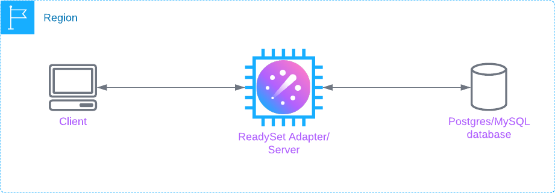
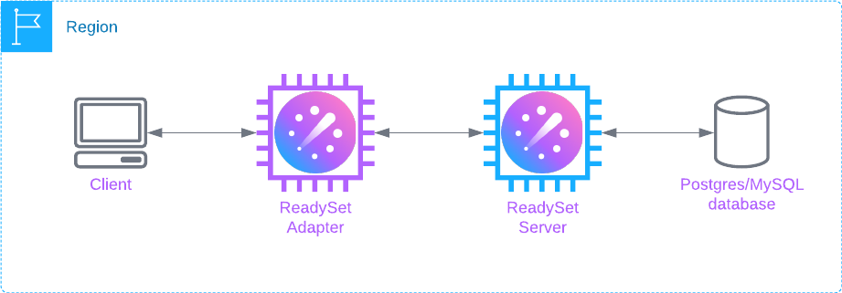
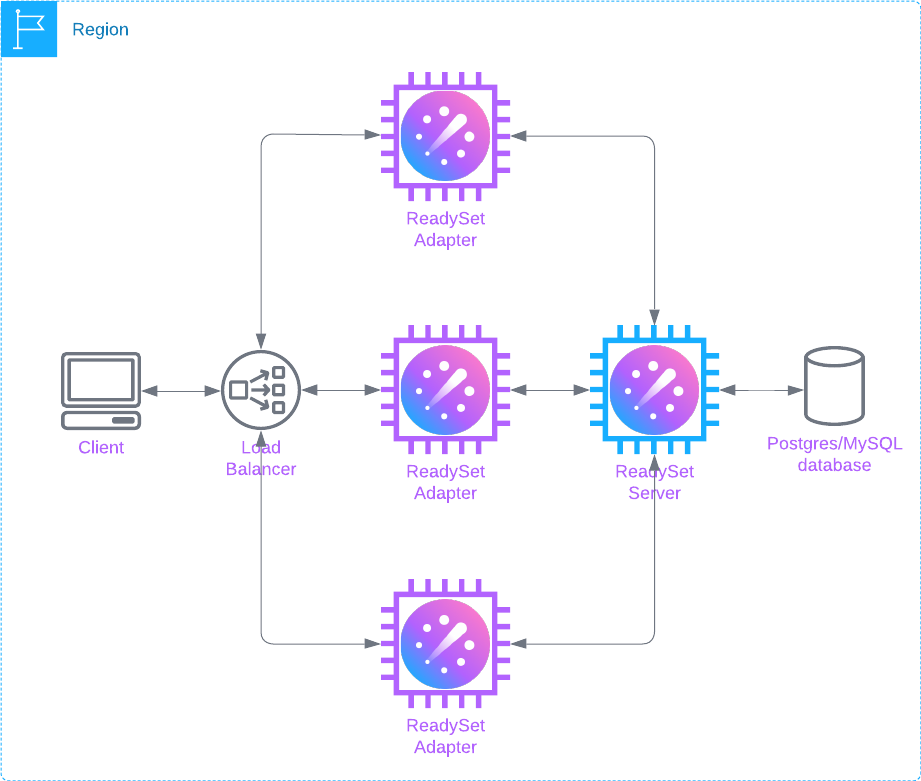
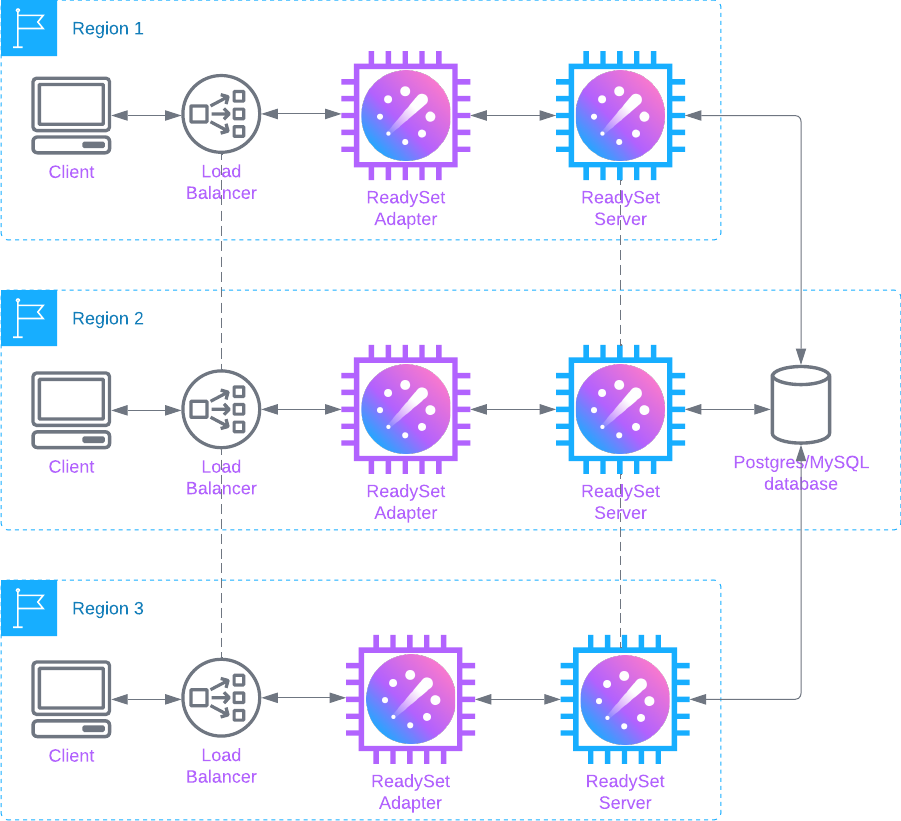

# Production Notes

This page provides recommendations for production deployments of ReadySet.

These recommendations apply to both self-managed deployments of ReadySet Core, and ReadySet-managed deployments on ReadySet Cloud. However, on [ReadySet Cloud](deploy-readyset-cloud.md), ReadySet takes care of all hardware and infrastructure setup and management for you.

## Deployment patterns

A ReadySet deployment sits between your application and database and contains the following core components:

| Component | Purpose |
|-----------|---------|
| ReadySet Server | Takes a snapshot of your database, listens to the database's replication stream for updates, and keeps queries cached in an in-memory dataflow graph. |
| ReadySet Adapter | Handles connections from SQL clients and ORMs, forwards uncached queries to the upstream database, and runs cached queries against the ReadySet Server.

Depending on your workload and needs, these components can be deployed in various ways:

- [Basic](#basic)
- [Scale out](#scale-out)
- [Multi-region](#multi-region)

!!! tip

    For all patterns, make sure your application has failover logic to route queries directly to the upstream database in the case that ReadySet becomes unavailable.

### Basic

When your application is running in a single region, it's usually sufficient to run the ReadySet Server and ReadySet Adapter as a single process on a single machine:

### Scale out

When your single-region application is too demanding for a combined Server and Adapter deployment, you can run them as separate processes on separate machines:

!!! note

    When running the Server and Adapter separately, ReadySet uses a third process, Consul, to handle internal cluster state and coordination across components. Consul is not depicted in the following diagrams.

For even more throughput, you can run multiple Adapters, with a load balancer distributing traffic evenly across them:

### Multi-region

When your application is running across multiple regions, you can run a ReadySet Server and one or more Adapters in each region, with a load balancer in each region configured to redirect traffic to other regions when a region’s Server and/or Adapters are unhealthy or unavailable.

!!! warning

    This pattern has not been thoroughly tested by ReadySet. If you are interested in deploying ReadySet in a multi-region context, please [reach out](mailto:info@readyset.io) for guidance.

## Hardware

ReadySet is a memory-intensive application. Size your hardware to comfortably hold your working data in memory.

For testing ReadySet in the [Basic](#basic) deployment pattern, start with 2 GiB of RAM and 2 vCPUs (e.g., the `t3.small` instance on AWS) and scale up with increased data size and workload.

## Storage

As the basis for caching and maintaining query results in-memory, ReadySet stores a snapshot of your database on disk and keeps this snapshot up to date by listening to your database's replication stream.

To accommodate growth in your dataset, size storage for the ReadySet Server to 2x the size of your database.

## Networking

For efficient and secure networking, deploy ReadySet into the same [VPC](https://en.wikipedia.org/wiki/Virtual_private_cloud) as your database. If that's not possible, deploy ReadySet into its own VPC and set up VPC peering between ReadySet, the upstream database, and your application.

## Database versions

ReadySet is wire-compatible with MySQL and Postgres and has been tested against the following database versions:

- Postgres 13 and 14
- MySQL 8

If you run ReadySet against another database version and experience problems, please [file an issue](https://github.com/readysettech/readyset/issues/new/choose).

## Database configuration

The upstream database must be configured to allow ReadySet to connect to the database and to consume the database's replication stream, which ReadySet uses to keep its cache up-to-date as the database changes.

!!! tip

    For step-by-step database configuration guidance, see [Deploy with ReadySet Cloud](deploy-readyset-cloud.md) or [Deploy with Kubernetes](deploy-readyset-kubernetes.md).

### Amazon RDS for Postgres

- [Logical replication](https://www.postgresql.org/docs/current/logical-replication.html) must be enabled.

    ReadySet uses Postgres' logical replication feature to keep the cache up-to-date as the underlying database changes.

- ReadySet must be connected to the primary database instance. ReadySet cannot work off an RDS [read replica](https://docs.aws.amazon.com/AmazonRDS/latest/UserGuide/USER_ReadRepl.html).  

- ReadySet does not support [row-level security](https://www.postgresql.org/docs/current/ddl-rowsecurity.html). Make sure any RLS policies are disabled.

- Before connecting ReadySet, make sure tables without primary keys have [`REPLICA IDENTITY FULL`](https://www.postgresql.org/docs/current/sql-altertable.html#SQL-ALTERTABLE-REPLICA-IDENTITY). Otherwise, Postgres will block writes and deletes on those tables.

### Amazon RDS for MySQL

- [Automated backups](https://docs.aws.amazon.com/AmazonRDS/latest/UserGuide/USER_WorkingWithAutomatedBackups.html#USER_WorkingWithAutomatedBackups.Enabling) must be enabled.

    ReadySet uses the [binary log](https://dev.mysql.com/doc/refman/5.7/en/binary-log.html) to keep the cache up-to-date as the underlying database changes. In RDS MySQL, the binary log is enabled only when automated backups are also enabled.

- The [binary logging format](https://dev.mysql.com/doc/refman/5.7/en/binary-log-setting.html) must be set to `ROW`.

- ReadySet must be connected to the primary database instance. ReadySet cannot work off a [read replica](https://docs.aws.amazon.com/AmazonRDS/latest/UserGuide/USER_ReadRepl.html).  

### Supabase

- In Supabase, [logical replication](https://www.postgresql.org/docs/current/logical-replication.html) is already enabled. However, you must change the `postgres` user's permissions to `SUPERUSER` so that ReadySet can create a replication slot.  

- ReadySet does not support [row-level security](https://www.postgresql.org/docs/current/ddl-rowsecurity.html). Make sure any RLS policies are disabled.

- Before connecting ReadySet, make sure tables without primary keys have [`REPLICA IDENTITY FULL`](https://www.postgresql.org/docs/current/sql-altertable.html#SQL-ALTERTABLE-REPLICA-IDENTITY). Otherwise, Postgres will block writes and deletes on those tables.
