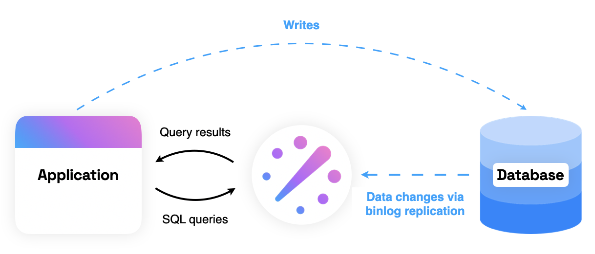

# What is ReadySet?

ReadySet is a lightweight SQL caching engine that sits between your application and database and turns even the most complex SQL reads into lightning-fast lookups. Unlike other caching solutions, ReadySet requires no changes to your application code.

Based on years of dataflow research at MIT[^1], ReadySet stores the results of queries in-memory and automatically keeps queries up-to-date as the underlying database is updated. When the cache gets too full, ReadySet dynamically chooses which rows to evict. ReadySet can do this automatically because it listens to your database's replication logs.

This means:

- No extra code to keep your cache and database in sync
- No extra code to evict stale records
- No TTLs to set - your cache is as up-to-date as your replication lag

ReadySet is wire-compatible with MySQL and Postgres. For more on how ReadySet works under the hood, see [Concepts](concepts/overview.md).

[^1]: See the [Noria](https://pdos.csail.mit.edu/papers/noria:osdi18.pdf) paper.
